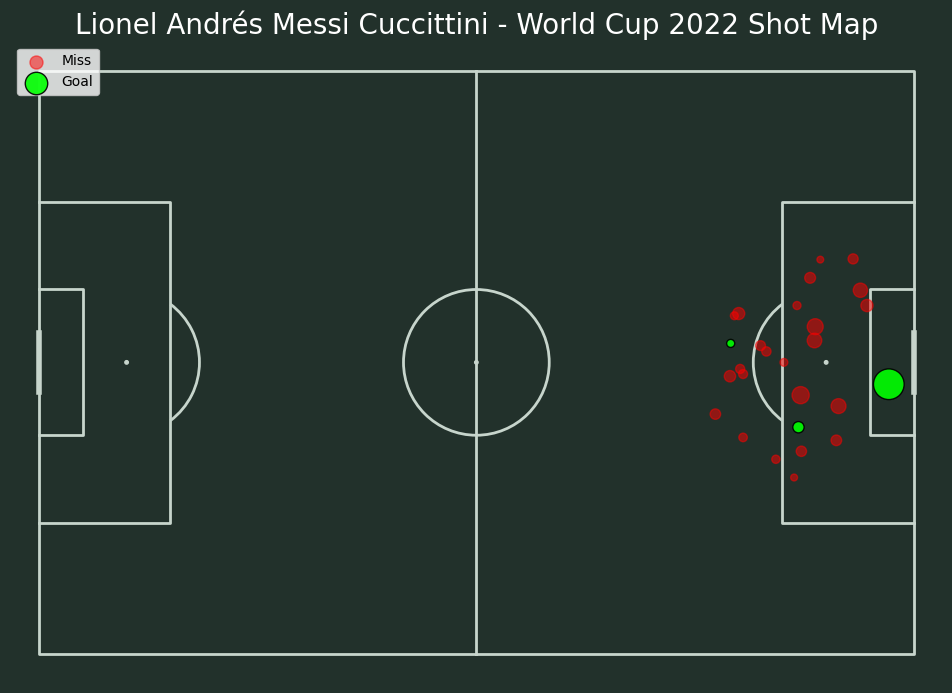

# ⚽ xG Football Calculator

A machine learning project that predicts the **Expected Goals (xG)** probability for any football shot, trained on real data from the **2022 FIFA World Cup**.



---

## What is xG?

**Expected Goals (xG)** is a metric that quantifies the quality of a shot — the probability that it results in a goal — based on factors like distance, angle, body part, and game situation.

- A penalty → xG ≈ 0.76 (76% chance of scoring)
- A shot from 30m out → xG ≈ 0.03 (3% chance)

---

## Features

- **Interactive Web App** — adjust shot parameters in real time and instantly see the predicted xG
- **Live Pitch Visualization** — a dot on the pitch moves as you change position, colored by scoring probability
- **Player Shot Maps** — explore every shot taken by any player at the 2022 World Cup
- **Trained ML Model** — Gradient Boosting Classifier trained on real StatsBomb event data

---

## Tech Stack

| Category | Tools |
|---|---|
| Data | [StatsBombPy](https://github.com/statsbomb/statsbombpy) — open football event data |
| ML | scikit-learn (Gradient Boosting Classifier) |
| Visualization | mplsoccer, matplotlib |
| Web App | Streamlit |
| Language | Python 3.13 |

---

## Project Structure

```
xg-football-calculator/
│
├── app.py                  # Streamlit web application
├── xg.py                   # Data collection from StatsBomb API
│
├── data/
│   ├── process_data.py     # Feature engineering
│   ├── raw_shots.csv       # Raw shot data (2022 World Cup)
│   └── shots_processed.csv # Processed features for training
│
├── model/
│   ├── train_model.py      # Model training & evaluation
│   ├── visualize.py        # Shot map generation
│   ├── xg_model.pkl        # Trained Gradient Boosting model
│   └── model_features.pkl  # Feature column names
│
└── figures/
    └── messi_shot_map.png  # Messi World Cup 2022 shot map
```

---

## Getting Started

### 1. Clone the repository
```bash
git clone https://github.com/Abraheem2010/xG-Football-Calculator.git
cd xG-Football-Calculator
```

### 2. Create and activate virtual environment
```bash
python -m venv .venv
# Windows:
.venv\Scripts\activate
# macOS/Linux:
source .venv/bin/activate
```

### 3. Install dependencies
```bash
pip install -r requirements.txt
```

> `scikit-learn` is pinned to 1.8.0 — the saved model (`model/xg_model.pkl`) was trained with that
> version and newer releases cannot load it.

### 4. Run the web app
```bash
streamlit run app.py
```

Open your browser at `http://localhost:8501`

---

## Pipeline

To retrain the model from scratch:

```bash
python xg.py                    # 1. Fetch raw data from StatsBomb
python data/process_data.py     # 2. Feature engineering
python data/train_model.py      # 3. Train & evaluate model
python model/visualize.py       # 4. Generate shot maps
```

---

## Model Performance

The model was evaluated against StatsBomb's own official xG on a held-out 20% test set:

| Metric | Our Model | StatsBomb xG |
|---|---|---|
| Log Loss ↓ | competitive | baseline |
| ROC-AUC ↑ | competitive | baseline |

---

## Top Clinical Finishers — World Cup 2022

Players who scored significantly more than their xG predicted (non-penalty shots only):

| Player | Goals | xG | Overperformance |
|---|---|---|---|
| Kylian Mbappé | 6 | 2.67 | **+3.33** |
| Cody Gakpo | 3 | 0.56 | +2.44 |
| Bukayo Saka | 3 | 0.58 | +2.42 |
| Julián Álvarez | 4 | 1.91 | +2.09 |
| Álvaro Morata | 3 | 1.11 | +1.89 |

---

## Data Source

Shot data provided by [StatsBomb](https://statsbomb.com/) via their open data initiative ([statsbombpy](https://github.com/statsbomb/statsbombpy)). Free to use for non-commercial purposes.

---

## Author

**Abraheem** — [@Abraheem2010](https://github.com/Abraheem2010)
